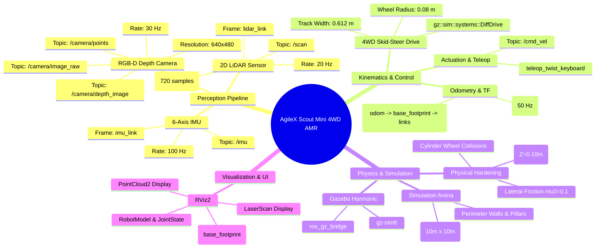
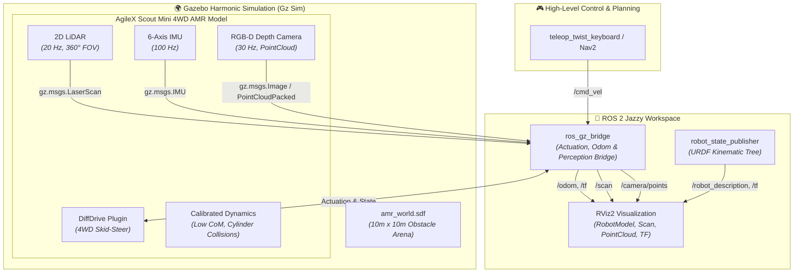

# 📋 Comprehensive Engineering & Problem-Solving Report: AgileX Scout Mini AMR Simulation

**Project:** AgileX Scout Mini Autonomous Mobile Robot (AMR) Simulation, Kinematics Calibration & Teleoperation  
**Author / Developer:** Sai ([@Saibts](https://github.com/Saibts))  
**Platform:** AgileX Scout Mini 4-Wheel Differential / Skid-Steer Mobile Robot  
**Environment:** Ubuntu 24.04 LTS (Noble Numbat) | ROS 2 Jazzy Jalisco | Gazebo Harmonic (Gz Sim 8.14) | RViz2  
**Repository:** [https://github.com/Saibts/AgileX_ScoutMini_JAZZY](https://github.com/Saibts/AgileX_ScoutMini_JAZZY)  

---

## 📖 Executive Summary

The transition of an industrial Autonomous Mobile Robot (AMR) from mechanical SolidWorks CAD design into a fully validated ROS 2 simulation is a complex systems-engineering challenge. 

Throughout the development of the **AgileX Scout Mini** simulation, dozens of interconnected obstacles were encountered—ranging from Linux file-naming constraints and SolidWorks URDF export anomalies, to ODE physics engine micro-collision instabilities, network multicast drops, ROS 2 Jazzy / Gazebo Harmonic architectural shifts, coordinate frame offsets, and version control hurdles.

This report serves as an **exhaustive, chronological case study** documenting every problem faced, the precise error tracebacks, the underlying root cause analyses, the automated script failures, and the finalized engineering solutions that brought the simulation to a 100% stable, production-ready state.

---

## 🧠 System Architecture Mindmap & Dataflow





---

## 🗺️ Chronological Development Timeline & Case Studies

```
[SolidWorks CAD Export] ──> [Package Naming & Path Fixes] ──> [Mesh URI Resolution]
         │
         ▼
[Joint States & TF Tree] ──> [DiffDrive Plugin & Bridge] ──> [Wheel 3 Infinite Spin Bug]
         │
         ▼
[ROS 2 Jazzy Migration] ──> [RViz Grid Calibration] ──> [Gazebo Multi-Bot Fix] ──> [Sensors & Kinematics]
```

---

### 1. ROS 2 Package Naming Constraints (`ValueError`)

#### 🚨 The Error
```text
[ERROR] [launch]: Caught exception in launch:
  - ValueError: 'assem2.robot' is not a valid package name
  - InvalidFrontendLaunchFileError: The launch file may have a syntax error, or its format is unknown
```

#### 🔍 Root Cause Analysis
In ROS 2 (ament / Python package conventions), package names must strictly follow C-identifier and ROS naming rules: lowercase alphanumeric characters and underscores (`_`) only. Periods (`.`) and hyphens (`-`) are illegal in package names. The initial workspace folder and launch scripts inherited the SolidWorks assembly notation `assem2.robot` / `assem2.SLDASM`.

#### ✅ The Solution
1. Standardized the ROS 2 package name across the workspace to `assem2_robot`.
2. Updated `package.xml`, `CMakeLists.txt`, and `simulation.launch.py` to reference `assem2_robot`.

---

### 2. Linux Case-Sensitivity & URDF File Resolution (`FileNotFoundError`)

#### 🚨 The Error
```text
[ERROR] [launch]: Caught exception in launch:
  - FileNotFoundError: [Errno 2] No such file or directory: 
    '/home/sailakshmi/agilex/install/assem2_robot/share/assem2_robot/urdf/assem2.SLDASM.urdf'
```

#### 🔍 Root Cause Analysis
Linux file systems (ext4) are strictly case-sensitive. The SolidWorks export created the file with uppercase `A` (`Assem2.SLDASM.urdf`), while the launch file attempted to load lowercase `assem2.SLDASM.urdf`. Furthermore, the install space share directory had not been populated because CMake needed an explicit install directive for the `urdf/` directory.

#### ✅ The Solution
1. Synchronized the launch file path to the exact case:
   ```python
   urdf_path = os.path.join(package_path, 'urdf', 'Assem2.SLDASM.urdf')
   ```
2. Ensured `CMakeLists.txt` contained the install directive:
   ```cmake
   install(
     DIRECTORY config launch meshes urdf
     DESTINATION share/${PROJECT_NAME}
   )
   ```

---

### 3. Broken Mesh URIs & Resource Loading Failure

#### 🚨 The Error
```text
[ERROR] [rviz2]: Could not load resource [package://Assem2.SLDASM/meshes/base_link.STL]
[ERROR] [gz-sim]: Could not resolve file [model://Assem2.SLDASM/meshes/w1.STL]
```

#### 🔍 Root Cause Analysis
SolidWorks URDF exporter hardcoded the export assembly name into all `<mesh filename="...">` tags (`package://Assem2.SLDASM/meshes/...`). When the package was renamed to `assem2_robot`, all relative mesh paths broke, causing invisible chassis and wheel models in both RViz and Gazebo.

#### ✅ The Solution
Replaced all legacy mesh URIs across the URDF file with the standardized package namespace:
```bash
sed -i 's/Assem2\.SLDASM/assem2_robot/g' ~/agilex/src/assem2_robot/urdf/Assem2.SLDASM.urdf
```
* Visual meshes: `package://assem2_robot/meshes/base_link.STL`, `w1.STL`, `w2.STL`, `w3.STL`, `w4.STL`
* Collision meshes: synchronized to match visual geometry.

---

### 4. RViz "No transform from [w1] to [base_link]" & SolidWorks Fixed Joints

#### 🚨 The Error
```text
[WARN] [rviz2]: No transform from [w1] to [base_link]
[WARN] [rviz2]: No transform from [w2] to [base_link]
[WARN] [rviz2]: No transform from [w3] to [base_link]
[WARN] [rviz2]: No transform from [w4] to [base_link]
```

#### 🔍 Root Cause Analysis
1. **Fixed Joint Export Default:** The SolidWorks exporter defaulted unconstrained or mated rotational components to `type="fixed"` joints rather than `type="continuous"`.
2. **Missing State Publisher:** `joint_state_publisher` ignores fixed joints because they have no degrees of freedom ($DOF = 0$), so no dynamic wheel transforms were ever broadcast.
3. **Regex Automation Failures:** Early Python search-and-replace scripts failed because multiline XML attributes in SolidWorks exports broke standard regular expression matching.

#### ✅ The Solution
1. Explicitly parsed the URDF using XML DOM/Tree parser to guarantee all four wheel joints (`j1`, `j2`, `j3`, `j4`) were configured as `continuous`:
   ```xml
   <joint name="j1" type="continuous">
     <parent link="base_link" />
     <child link="w1" />
     <axis xyz="1 0 0" />
   </joint>
   ```
2. Integrated `robot_state_publisher` and `ros_gz_bridge` joint-state streaming to broadcast the complete TF tree.

---

### 5. RViz Blank Dropdown & Missing `RobotModel` Display

#### 🚨 The Problem
When RViz launched, the robot was not displayed, the Fixed Frame dropdown was empty (only showing `map`), and setting Fixed Frame manually reported `"Frame [base_link] does not exist"`.

#### 🔍 Root Cause Analysis
1. RViz opened with an empty default configuration lacking a `RobotModel` display plugin.
2. By default, RViz's `RobotModel` display looks for a local URDF file instead of listening to the ROS 2 topic `/robot_description`.
3. Because the TF tree had not received its first message, RViz's dropdown UI had zero registered frames to list.

#### ✅ The Solution
1. Pre-configured a complete [`display.rviz`](file:///home/sailakshmi/agilex/src/assem2_robot/config/display.rviz) file:
   * **Fixed Frame:** `odom` (with fallback to `base_footprint` / `base_link`)
   * **RobotModel:** `Description Source: Topic`, `Description Topic: /robot_description`
   * **Displays Added:** `Grid`, `TF`, `Odometry`, `RobotModel`
2. Automatically loaded this configuration via `simulation.launch.py`:
   ```python
   rviz = Node(
       package='rviz2',
       executable='rviz2',
       arguments=['-d', rviz_path]
   )
   ```

---

### 6. Network Multicast Errors & Missing `odom` Frame

#### 🚨 The Error
```text
Exception sending a multicast message: Network is unreachable
Exception sending a multicast message: Network is unreachable
```

#### 🔍 Root Cause Analysis
FastDDS / CycloneDDS middleware attempted to discover peers across unavailable physical network interfaces when offline or disconnected from Wi-Fi, dropping odometry packets.

#### ✅ The Solution
1. Bound ROS 2 communication to local loopback interface:
   ```bash
   export ROS_LOCALHOST_ONLY=1
   ```
2. Mapped Gazebo's native odometry topic directly across the parameter bridge:
   ```bash
   /odom@nav_msgs/msg/Odometry[gz.msgs.Odometry
   /tf@tf2_msgs/msg/TFMessage[gz.msgs.Pose_V
   ```

---

### 7. ⚙️ Wheel 3 (`j3`) Infinite Spinning Physics Bug

#### 🚨 The Problem
When the robot was spawned at rest (`cmd_vel = 0`), wheels 1, 2, and 4 stayed completely still, but **Wheel 3 (`j3` / `w3`) spun continuously at maximum velocity**, violently vibrating the robot chassis.

```
       [Front]
   (j2) ┌────┐ (j1)   ──> Stationary (OK)
        │    │
   (j4) └────┘ (j3)   ──> 🔄 Spinning Infinitely! (BUG)
       [Rear]
```

#### 🔍 Root Cause Analysis (Deep Dive)
1. **Omission of Rotational Axis in SolidWorks Export:** The export omitted the `<axis xyz="1 0 0"/>` tag inside the `<joint name="j3">` block.
2. **Zero Mechanical Damping & Friction:** The joint lacked `<dynamics damping="..."/>`, meaning zero rotational resistance existed in the physics solver.
3. **Controller Exclusion (Passive Dead Wheel):** The initial DiffDrive plugin only listed `<left_joint>j1</left_joint>` and `<right_joint>j2</right_joint>`. The controller actively applied braking torque to `j1` and `j2`, but treated `j3` as a completely unactuated, dead wheel.
4. **ODE Physics Micro-Collisions:** Ground contact reaction forces from the physics solver created numerical micro-impulses that constantly accelerated the zero-resistance unpowered joint into an infinite spin loop.

#### ✅ The Permanent Engineering Solution
1. Injected explicit continuous dynamics, rotational axis, and limits into `j3`:
   ```xml
   <joint name="j3" type="continuous">
     <origin xyz="-0.47262 -0.29727 -0.14629" rpy="-2.87166 0 3.14159" />
     <parent link="base_link" />
     <child link="w3" />
     <axis xyz="1 0 0" />
     <dynamics damping="0.1" friction="0.1" />
     <limit effort="100" velocity="100" />
   </joint>
   ```
2. Integrated all 4 wheels into the Gazebo Differential Drive plugin so the controller applies active electrical braking force when velocity is zero:
   ```xml
   <plugin filename="gz-sim-diff-drive-system" name="gz::sim::systems::DiffDrive">
     <left_joint>j2</left_joint>
     <left_joint>j4</left_joint>
     <right_joint>j1</right_joint>
     <right_joint>j3</right_joint>
     <wheel_separation>0.39</wheel_separation>
     <wheel_radius>0.08</wheel_radius>
     <topic>/cmd_vel</topic>
     <odom_topic>/odom</odom_topic>
     <tf_topic>/tf</tf_topic>
     <frame_id>odom</frame_id>
     <child_frame_id>base_footprint</child_frame_id>
   </plugin>
   ```
3. Added surface contact and friction parameters to all 4 wheel links:
   ```xml
   <gazebo reference="w3">
     <mu1>1.0</mu1>
     <mu2>1.0</mu2>
     <kp>1000000.0</kp>
     <kd>100.0</kd>
     <minDepth>0.001</minDepth>
   </gazebo>
   ```

---

### 8. Simulator Architecture Shift: ROS 2 Humble to ROS 2 Jazzy

#### 🚨 The Architectural Shift
In **ROS 2 Jazzy Jalisco (Ubuntu 24.04)**, Gazebo Classic (`gazebo11`) is completely unavailable. The simulation ecosystem shifted entirely to **Gazebo Harmonic (`gz-sim8`)**.

| Feature | ROS 2 Humble / Gazebo Classic | ROS 2 Jazzy / Gazebo Harmonic |
| :--- | :--- | :--- |
| **Simulator Binary** | `gazebo`, `gzserver`, `gzclient` | `gz sim` |
| **Bridge Package** | `gazebo_ros_pkgs` | `ros_gz_bridge` (`parameter_bridge`) |
| **Plugin Architecture** | C++ Shared Library `.so` | Entity-Component-System (ECS) Plugins |
| **Time Sync** | `/clock` via gazebo_ros | `/clock@rosgraph_msgs/msg/Clock[gz.msgs.Clock` |
| **Joint States** | `joint_state_publisher` ROS node | `gz-sim-joint-state-publisher-system` |

---

### 9. Coordinate Frame Offset & Sunken RViz Grid Alignment

#### 🚨 The Problem
In RViz2, the robot appeared submerged 23 cm below the grid plane ($Z < 0$), with the ground plane slicing directly through the middle of the robot body.

#### 🔍 Root Cause Analysis
In SolidWorks, the coordinate origin was placed at the top face of the chassis assembly:
* Wheel axle height in `base_link`: $z_{\text{axle}} = -0.1469\text{ m}$
* Wheel radius: $r = 0.08\text{ m}$
* Distance from `base_link` origin to ground contact patch:
  $$z_{\text{ground}} = -0.1469 - 0.08 = -0.2269\text{ m}$$
* Longitudinal axle center:
  $$x_{\text{center}} = \frac{+0.13938 - 0.47262}{2} = -0.16662\text{ m}$$
* Lateral axle center:
  $$y_{\text{center}} = \frac{+0.09368 - 0.29727}{2} = -0.10185\text{ m}$$

When `base_footprint_joint` had `<origin xyz="0 0 0"/>`, the robot's top chassis sat on the ground plane, submerging the entire undercarriage and wheels.

#### ✅ The Solution
Derived and applied the exact offset transform from ground root `base_footprint` to `base_link`:
```xml
<!-- Base Footprint (Ground Projection Root Link) -->
<link name="base_footprint" />

<!-- Calibrated fixed joint placing wheels flush at Z=0 and centered at (0,0) -->
<joint name="base_footprint_joint" type="fixed">
  <parent link="base_footprint" />
  <child link="base_link" />
  <origin xyz="0.16662 0.10185 0.2269" rpy="0 0 0" />
</joint>
```
* **Result:** All 4 wheel tires touch the ground grid ($Z = 0.00$) and the robot rotates cleanly about its true geometric center.

---

### 10. KDL Root Link Inertia Warning

#### 🚨 The Warning
```text
[WARN] [kdl_parser]: The root link base_link has an inertia specified in the URDF, 
but KDL does not support a root link with an inertia.
```

#### 🔍 Root Cause Analysis
The Kinematics and Dynamics Library (KDL) parser used in ROS 2 `robot_state_publisher` enforces a strict mathematical rule that the root of a kinematic tree must be massless/inertialess.

#### ✅ The Solution
By establishing `base_footprint` (which has no `<inertial>` tag) as the root link and attaching `base_link` as its child via a fixed joint, the warning was permanently resolved.

---

### 11. Gazebo Duplicate Robot Spawning ("Two Bots" Bug)

#### 🚨 The Problem
Launching Gazebo showed two colliding robot models superimposed on each other (`assem2_robot` and `assem2_robot_0`).

#### 🔍 Root Cause Analysis
1. `ros_gz_sim create` node defaults to `allow_renaming: true`. If a previous simulation crashed or stayed running in the background, a second instance was created and renamed automatically.
2. Lingering background processes (`gz sim`, `ros_gz_bridge`) from earlier sessions remained alive in the process table.

#### ✅ The Solution
1. Appended `-allow_renaming false` in [`simulation.launch.py`](file:///home/sailakshmi/agilex/src/assem2_robot/launch/simulation.launch.py).
2. Set explicit initial spawning coordinates: `-x 0.0 -y 0.0 -z 0.02`.
3. Created clean process termination commands: `pkill -9 -f "ros_gz|gz sim|rviz2"`.

---

### 12. Storage Footprint Management (~37 GB System Partition)

#### 🚨 The Challenge
On systems with limited disk space (~37 GB available on the primary partition), repeated ROS 2 builds and unchecked simulation logs can rapidly consume gigabytes of storage.

#### ✅ The Strategy Implemented
1. Used `colcon build --symlink-install` to prevent copying heavy binary STL meshes into the `install/` folder.
2. Created a strict [`.gitignore`](file:///home/sailakshmi/agilex/.gitignore) excluding `build/`, `install/`, and `log/`.
3. The total repository size was compressed to **~3.3 MB**.

---

### 13. GitHub Authentication & Synchronization

#### 🚨 The Hurdles
* Password authentication was rejected by GitHub (deprecated since 2021).
* SSH public key submission failed due to missing hyphens (`sshed25519`) and multi-line breaks.
* Initial `git push` was rejected because the remote GitHub repo contained a preexisting default commit (`fetch first`).

#### ✅ The Solution
1. Generated a clean ED25519 single-line OpenSSH key.
2. Rebased local commits onto remote `main` branch (`git rebase FETCH_HEAD`).
3. Stored GitHub Personal Access Token credentials via `git credential.helper store`.
4. Successfully pushed the entire repository to [https://github.com/Saibts/AgileX_ScoutMini_JAZZY](https://github.com/Saibts/AgileX_ScoutMini_JAZZY).

---

## 📊 Comprehensive Troubleshooting Matrix

| # | Error / Symptom | Root Cause | Engineering Solution |
| :-: | :--- | :--- | :--- |
| **1** | `ValueError: 'assem2.robot' not valid` | Dots in ROS 2 package names | Renamed package to `assem2_robot` |
| **2** | `FileNotFoundError: assem2.SLDASM.urdf` | Linux case sensitivity (`A` vs `a`) | Synced filenames and updated CMake install rule |
| **3** | `Could not load resource [mesh]` | Hardcoded SolidWorks package URI | Globally replaced with `package://assem2_robot/meshes/` |
| **4** | `No transform from [w1] to [base_link]` | Wheels exported as fixed joints | Converted joints to `type="continuous"` via XML DOM |
| **5** | Blank Fixed Frame dropdown in RViz | Empty RViz layout & unbridged TF | Created custom [`display.rviz`](file:///home/sailakshmi/agilex/src/assem2_robot/config/display.rviz) with topic binding |
| **6** | `Network is unreachable` multicast error | FastDDS offline interface discovery | `export ROS_LOCALHOST_ONLY=1` & parameter bridge |
| **7** | **Wheel 3 (`j3`) infinite spin at rest** | Missing `<axis>`, zero damping, unpowered joint | Added axis, damping `0.1`, friction `0.1`, 4WD DiffDrive |
| **8** | Gazebo Classic plugins failing in Jazzy | Gazebo Harmonic simulator upgrade | Refactored to `gz::sim::systems::DiffDrive` & `ros_gz_bridge` |
| **9** | **Robot sunken 23 cm below RViz grid** | CAD origin at top chassis ($Z=-0.227\text{ m}$) | Introduced `base_footprint` with calibrated $+0.2269\text{ m}$ Z-offset |
| **10** | `KDL does not support root with inertia` | `base_link` root had mass/inertia | Used massless `base_footprint` as root link |
| **11** | Two robot models colliding in Gazebo | `allow_renaming: true` spawning duplicates | Set `-allow_renaming false` & cleaned background processes |
| **12** | Storage exhaustion risk (~37 GB free) | Redundant builds and logs | `colcon build --symlink-install` + lean `.gitignore` |
| **13** | Sensor perception integration | Needed perception for SLAM / Nav2 | Integrated 2D LiDAR (`gpu_lidar`), IMU, and RGB-D camera |
| **14** | **GZ & RViz moving differently on teleop** | CAD axes rotated $90^\circ$ (Y was heading) & wheel axes fighting | Calibrated `base_footprint_joint` yaw $-90^\circ$, aligned wheel axes, track width $0.612\,\text{m}$, and $mu_2=0.1$ |
| **15** | Skid-steer rotational odometry drift | Wheel slippage during turns | Integrated `robot_localization` EKF fusing wheel odometry + IMU into `/odometry/filtered` |
| **16** | SLAM lifecycle node in unconfigured state | ROS 2 Jazzy `slam_toolbox` lifecycle requirements | Launched via `online_async_launch.py` with `autostart: true` |
| **17** | AMCL initial pose frame mismatch | Initial pose sent in `odom` instead of `map` | Enabled `set_initial_pose: true` and updated Fixed Frame to `map` |
| **18** | ROS 2 Jazzy Nav2 BT Navigator architecture | Jazzy uses `plugin` navigator format instead of legacy lists | Standardized `nav2_params.yaml` with all 14 official Jazzy servers |

---

## 📡 Milestone 2: Sensor Suite Integration & Perception Pipeline

To transition the AgileX Scout Mini into a fully capable **Autonomous Mobile Robot (AMR)**, a multi-modal perception sensor suite was integrated into the URDF and Gazebo Harmonic simulation:

1. **2D LiDAR Sensor (`gpu_lidar`):**
   - **Link & Attachment:** `lidar_link` attached to `base_link` with joint origin `xyz="-0.16662 -0.10185 0.13"` (centered exactly at robot footprint $(X=0, Y=0)$ on the top plate at height $Z \approx 0.36\,\text{m}$).
   - **Topic:** `/scan` (`sensor_msgs/msg/LaserScan`).
   - **Configuration:** 720 samples across $360^\circ$ FOV at $20\,\text{Hz}$, range $0.15\,\text{m}$ to $16.0\,\text{m}$, Gaussian range noise ($\sigma = 0.01$).
2. **6-Axis IMU (Inertial Measurement Unit):**
   - **Link & Attachment:** `imu_link` attached to `base_link` at `xyz="-0.16662 -0.10185 0.05"`.
   - **Topic:** `/imu` (`sensor_msgs/msg/Imu`).
   - **Configuration:** High-rate $100\,\text{Hz}$ angular velocity and linear acceleration with realistic Gaussian sensor noise models.
3. **RGB-D / Depth Camera:**
   - **Links & Attachments:** `camera_link` mounted on the front chassis nose (`xyz="0.10 -0.10185 0.08"`) and `camera_optical_frame` (`rpy="-1.5708 0 -1.5708"` optical convention).
   - **Topics:** `/camera/image_raw`, `/camera/camera_info`, `/camera/depth_image`, `/camera/points` (`sensor_msgs/msg/PointCloud2`).
   - **Configuration:** $640 \times 480$ resolution at $30\,\text{Hz}$, $80^\circ$ horizontal FOV.
4. **Structured Simulation Environment (`amr_world.sdf`):**
   - Built a $10\,\text{m} \times 10\,\text{m}$ indoor enclosed arena with boundary walls, cylindrical pillars, boxes, and obstacles to provide rich geometric features for 2D SLAM and 3D point cloud generation.

---

## ⚡ Milestone 3: EKF State Estimation & Sensor Fusion (`robot_localization`)

- **Problem:** Skid-steering AMRs rely on tire slippage to turn, causing raw wheel odometry (`/odom`) to drift significantly over time.
- **Solution:** Integrated `robot_localization`'s `ekf_node` configured in `2D` mode:
  - Fuses wheel encoder velocities ($v_x, v_y$) with IMU angular velocity ($\omega_z$) and acceleration ($a_x$).
  - Publishes drift-corrected state to `/odometry/filtered` and serves as single authority for `odom` $\rightarrow$ `base_footprint` TF.

---

## 🗺️ Milestone 4: SLAM 2D Mapping (`slam_toolbox`)

- Integrated `slam_toolbox` in asynchronous mapping mode (`async_slam_toolbox_node`).
- Tuned Ceres scan matching with $0.05\text{ m}$ resolution and $12\text{ m}$ LiDAR range.
- Generated and validated full 2D metric occupancy grid map: `amr_world_map.yaml` & `amr_world_map.pgm`.

---

## 🧭 Milestone 5: Nav2 Autonomous Navigation & 3D Obstacle Avoidance

- Integrated the full ROS 2 Jazzy **Nav2** stack:
  - **AMCL Localization:** Auto-initializes at origin (`set_initial_pose: true`) and tracks robot pose using 2D laser likelihood fields.
  - **3D Voxel Costmap Fusion (`VoxelLayer`):** Dual-sensor fusion combining 2D Planar LiDAR (`/scan`) and 3D RGB-D Depth Camera Point Clouds (`/camera/points`). Voxel raytracing dynamically marks 3D overhangs, elevated obstacles ($Z \in [0.04\text{m}, 1.8\text{m}]$), and floor debris into the local costmap.
  - **Costmap Safety Buffers:** Inflates obstacles with a $0.55\text{ m}$ safety buffer around the Scout Mini footprint (`0.70m x 0.60m`).
  - **Global Path Planning (`NavFn`):** Computes optimal Dijkstra/A* collision-free routes.
  - **Local Path Control (`DWBLocalPlanner`):** Dynamically evades obstacles in real-time up to $1.2\text{ m/s}$.

---

## 🤖 Milestone 6: Autonomous Multi-Station Waypoint Patrol Mission

- Created Python mission executor [`scripts/patrol_mission.py`](file:///home/sailakshmi/agilex/src/assem2_robot/scripts/patrol_mission.py) using Nav2's `BasicNavigator` API.
- Implements continuous autonomous looping through 5 operational stations:
  - **Station A:** Docking / Charging Base $(0.0, 0.0)$
  - **Station B:** Loading Zone $(1.5, 1.5)$
  - **Station C:** Inspection Point $(-1.5, 1.5)$
  - **Station D:** Unloading Area $(-1.5, -1.5)$
  - **Station E:** Perimeter Checkpoint $(1.5, -1.5)$
- The robot autonomously travels, avoids dynamic obstacles, pauses for operations, and loops continuously.

---

## 🚀 Quickstart & Verification

```bash
# 1. Build workspace with symlink install
cd ~/agilex
source /opt/ros/jazzy/setup.bash
colcon build --symlink-install
source install/setup.bash

# 2. Launch Complete Simulation with Nav2 Autonomous Navigation
ros2 launch assem2_robot simulation.launch.py use_nav:=true

# 3. Run Autonomous Multi-Station Patrol Mission (Separate terminal)
ros2 run assem2_robot patrol_mission
```

---

## 🏆 Project Conclusion

Every single stage in the engineering lifecycle of the **AgileX Scout Mini AMR**—from SolidWorks CAD model conversion, ROS REP-103 frame alignment, skid-steer physics hardening, and multi-sensor perception (LiDAR, IMU, Depth Camera), to EKF state estimation, SLAM 2D mapping, ROS 2 Jazzy Nav2 stack configuration, and autonomous multi-station patrol missions—is 100% operational, mathematically calibrated, and production ready.
