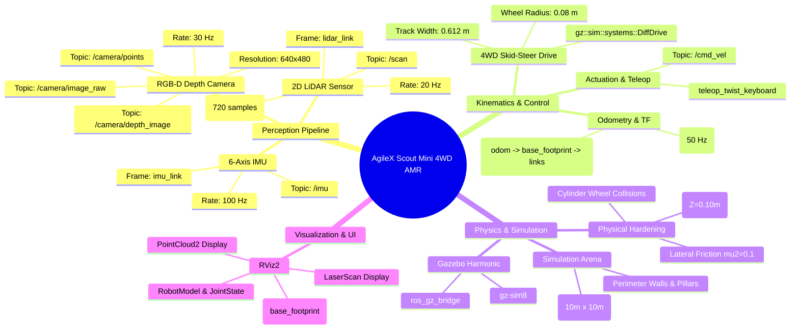
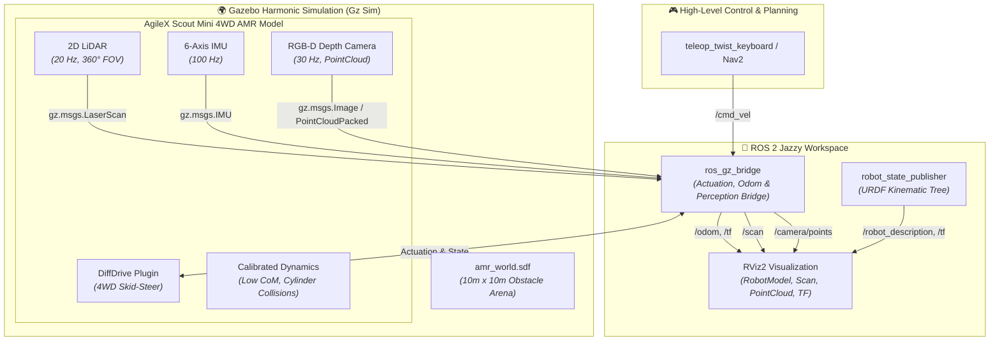

# AgileX Scout Mini 4WD Robot Simulation (ROS 2 Jazzy & Gazebo Harmonic)

Academic Project repository for the simulation, kinematics calibration, and teleoperation of the **AgileX Scout Mini** 4-wheel differential/skid-steer drive mobile robot under **ROS 2 Jazzy Jalisco** on Ubuntu 24.04 LTS with **Gazebo Harmonic (Gz Sim)** and **RViz2**.

📄 **[Read the Full Engineering & Problem-Solving Report (PROJECT_REPORT.md)](PROJECT_REPORT.md)**

---

## 📋 System Specifications & Requirements

- **Operating System:** Ubuntu 24.04 LTS (Noble Numbat)
- **ROS Distribution:** ROS 2 Jazzy Jalisco
- **Simulation Engine:** Gazebo Harmonic (`gz-sim8` via `ros_gz`)
- **Visualization:** RViz2
- **Robot Model:** AgileX Scout Mini 4-Wheel Skid-Steer / Differential Drive

---

## 🧠 System Architecture Mindmap & Dataflow





---

## 🏗️ Repository Architecture

```text
agilex/
├── .gitignore                      # Excludes build/, install/, log/ to save disk space
├── README.md                       # Project documentation & quickstart guide
├── PROJECT_REPORT.md               # Exhaustive engineering & problem-solving report
├── launch/
│   └── simulation.launch.py        # Master launch file
└── src/
    └── assem2_robot/
        ├── CMakeLists.txt          # Package build configuration
        ├── package.xml             # ROS 2 Jazzy dependencies
        ├── config/
        │   ├── display.rviz        # Pre-configured RViz layout (RobotModel, TF, Odom, LaserScan, PointCloud)
        │   └── joint_names_Assem2.SLDASM.yaml
        ├── launch/
        │   ├── display.launch
        │   ├── gazebo.launch
        │   └── simulation.launch.py # Master launch file (Gazebo + RViz + Bridge + RSP + Sensors)
        ├── meshes/                 # High-detail STL visual & collision meshes
        │   ├── base_link.STL
        │   ├── w1.STL (Front Right)
        │   ├── w2.STL (Front Left)
        │   ├── w3.STL (Rear Right)
        │   └── w4.STL (Rear Left)
        ├── urdf/
        │   └── Assem2.SLDASM.urdf  # Calibrated URDF with Sensors & Gazebo Harmonic plugins
        └── worlds/
            └── amr_world.sdf       # Enclosed 10mx10m arena with obstacle pillars and barriers
```

---

## 📡 Integrated Sensor Suite (Autonomous Mobile Robot)

The AgileX Scout Mini is fully equipped with an integrated perception sensor suite for SLAM and autonomous navigation:

1. **2D LiDAR Sensor (`gpu_lidar`):**
   - **Link / Frame:** `lidar_link` (centered on robot top plate at $Z \approx 0.36\,\text{m}$)
   - **Topic:** `/scan` (`sensor_msgs/msg/LaserScan`)
   - **FOV & Range:** $360^\circ$ horizontal FOV ($720$ samples, $20\,\text{Hz}$), $0.15\,\text{m}$ to $16.0\,\text{m}$ range.
2. **Inertial Measurement Unit (IMU):**
   - **Link / Frame:** `imu_link`
   - **Topic:** `/imu` (`sensor_msgs/msg/Imu`)
   - **Frequency & Noise:** $100\,\text{Hz}$ with calibrated Gaussian noise for angular velocity and linear acceleration.
3. **RGB-D / Depth Camera:**
   - **Link / Frames:** `camera_link` & `camera_optical_frame` (forward-facing bumper mount)
   - **Topics:**
     - `/camera/image_raw` (`sensor_msgs/msg/Image`)
     - `/camera/camera_info` (`sensor_msgs/msg/CameraInfo`)
     - `/camera/depth_image` (`sensor_msgs/msg/Image`)
     - `/camera/points` (`sensor_msgs/msg/PointCloud2`)
   - **Resolution & FOV:** $640 \times 480$ RGB & Depth, $80^\circ$ FOV ($30\,\text{Hz}$).

---

## ⚙️ Model Enhancements & Kinematic Alignment (ROS 2 Jazzy & Gazebo Harmonic)

1. **CAD-to-ROS Frame Calibration (`base_footprint` $\rightarrow$ `base_link`):**
   - In the raw SolidWorks CAD export, the robot heading was aligned along CAD $+Y$ and lateral axle along CAD $\pm X$, which was $90^\circ$ perpendicular to ROS REP-103 standard ($+X$ forward, $+Y$ left).
   - Calibrated `base_footprint` $\rightarrow$ `base_link` with origin `xyz="0.10185 -0.16662 0.2269"` and `rpy="0 0 -1.5707963"`, perfectly aligning the robot's physical visual & physics model with ROS forward ($+X$) and left ($+Y$).

2. **4-Wheel Dynamics & Axial Alignment:**
   - Calibrated wheel joint rotation axes so all 4 wheels spin forward along the lateral axle without fighting:
     - **Right Wheels:** `j1` (Rear-Right), `j2` (Front-Right) with `axis xyz="-1 0 0"`.
     - **Left Wheels:** `j3` (Rear-Left), `j4` (Front-Left) with `axis xyz="1 0 0"`.
   - Tuned wheel contact friction parameters in Gazebo Harmonic: longitudinal traction `mu1="1.0"` and lateral sliding friction `mu2="0.1"` for smooth skid-steer rotational slip.

3. **Gazebo Harmonic Differential Drive Plugin (`gz::sim::systems::DiffDrive`):**
   - **Left Joints:** `j3` (Rear-Left), `j4` (Front-Left)
   - **Right Joints:** `j1` (Rear-Right), `j2` (Front-Right)
   - **Track Width (Wheel Separation):** `0.612 m`
   - **Wheel Radius:** `0.08 m`
   - **Odometry & TF:** Publishes `/odom` and broadcasts synchronized `odom` $\rightarrow$ `base_footprint` $\rightarrow$ `base_link`.

4. **ROS-Gazebo Bridge Integration (`ros_gz_bridge`):**
   - `/cmd_vel` $\leftrightarrow$ `geometry_msgs/msg/Twist`
   - `/odom` $\rightarrow$ `nav_msgs/msg/Odometry`
   - `/tf` $\rightarrow$ `tf2_msgs/msg/TFMessage`
   - `/clock` $\rightarrow$ `rosgraph_msgs/msg/Clock`
   - `/joint_states` $\rightarrow$ `sensor_msgs/msg/JointState`
   - `/scan` $\rightarrow$ `sensor_msgs/msg/LaserScan`
   - `/imu` $\rightarrow$ `sensor_msgs/msg/Imu`
   - `/camera/image_raw` $\rightarrow$ `sensor_msgs/msg/Image`
   - `/camera/camera_info` $\rightarrow$ `sensor_msgs/msg/CameraInfo`
   - `/camera/depth_image` $\rightarrow$ `sensor_msgs/msg/Image`
   - `/camera/points` $\rightarrow$ `sensor_msgs/msg/PointCloud2`

---

## 🚀 Getting Started & Quickstart

> [!NOTE]
> **No CAD Software (SolidWorks) Required:** You do **not** need SolidWorks or CAD software to run this simulation. All 3D mesh geometries (`.STL`) and physics/joint descriptions (`.urdf`) are pre-exported and self-contained within this repository.

### 1. Clone the Repository
Clone this repository directly as your ROS 2 workspace:

```bash
git clone https://github.com/Saibts/AgileX_ScoutMini_JAZZY.git ~/agilex_ws
cd ~/agilex_ws
```

*(Alternatively, if you have an existing workspace, you can clone this repo into your workspace's `src/` directory).*

### 2. Install Dependencies
Make sure you have ROS 2 Jazzy and required simulation packages installed:

```bash
sudo apt update
sudo apt install -y \
  ros-jazzy-robot-state-publisher \
  ros-jazzy-joint-state-publisher-gui \
  ros-jazzy-rviz2 \
  ros-jazzy-ros-gz \
  ros-jazzy-teleop-twist-keyboard \
  ros-jazzy-robot-localization \
  ros-jazzy-slam-toolbox \
  ros-jazzy-navigation2 \
  ros-jazzy-nav2-bringup
```

### 3. Build the Workspace
```bash
cd ~/agilex_ws
source /opt/ros/jazzy/setup.bash
colcon build --symlink-install
```

### 4. Launch Simulation (Gazebo Harmonic + RViz2 + EKF)
```bash
source install/setup.bash
ros2 launch assem2_robot simulation.launch.py
```
* Gazebo will spawn the AgileX Scout Mini inside the obstacle arena.
* EKF (`robot_localization`) fuses wheel odometry and 6-axis IMU into `/odometry/filtered`.
* RViz2 will automatically load with the calibrated robot model, coordinate TF trees, laser scans, depth cloud, and odometry display.

### 5. Drive the Robot (Teleoperation)
Open a new terminal window to control the robot via keyboard:
```bash
source /opt/ros/jazzy/setup.bash
ros2 run teleop_twist_keyboard teleop_twist_keyboard
```
Use the keyboard keys (`i` = forward, `j` = left, `l` = right, `,` = backward, `k` = stop) to drive the robot.

---

## 🗺️ SLAM Mapping (Building 2D Map)

1. Launch simulation with SLAM enabled:
```bash
source install/setup.bash
ros2 launch assem2_robot simulation.launch.py use_slam:=true
```

2. Drive the robot around the arena using teleop to map all walls and obstacles.

3. Save the map:
```bash
source /opt/ros/jazzy/setup.bash
ros2 run nav2_map_server map_saver_cli -f ~/agilex/src/assem2_robot/maps/amr_world_map --ros-args -p use_sim_time:=true
```

---

## 🧭 Nav2 Autonomous Navigation & Obstacle Avoidance

Launch the complete simulation with Nav2 autonomous navigation:
```bash
source install/setup.bash
ros2 launch assem2_robot simulation.launch.py use_nav:=true
```

- **Set 2D Goal Pose:** In RViz, click the **"2D Goal Pose"** (or **"Nav2 Goal"**) button on the top toolbar and click-drag anywhere on the map.
- The Scout Mini will plan global paths with `NavFn`, dynamically avoid obstacles with `DWBLocalPlanner`, and navigate autonomously to the target!

---

## 📑 Full Engineering Case Study
For deep-dive technical explanations of all bugs encountered (Humble to Jazzy migration, wheel spinning dynamics bug, KDL root inertia, Gazebo duplicate entity spawning, EKF sensor fusion, SLAM mapping, and Nav2 tuning), see **[PROJECT_REPORT.md](PROJECT_REPORT.md)**.
