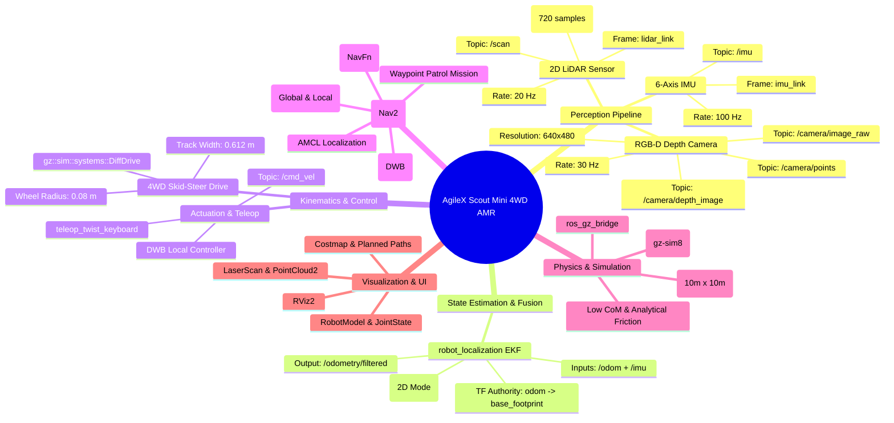
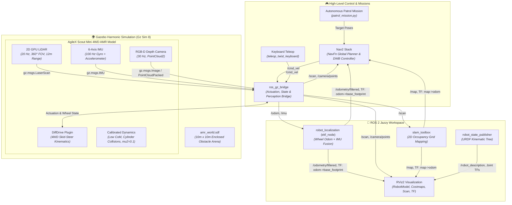

# 🧠 System Architecture Mindmap & Dataflow: AgileX Scout Mini AMR

This document outlines the detailed system architecture, subsystem dataflows, perception pipelines, kinematics, coordinate frames, and simulation topologies of the **AgileX Scout Mini Autonomous Mobile Robot (AMR)** in **ROS 2 Jazzy** and **Gazebo Harmonic**.

---

## 🗺️ System Architecture Mindmap



---

## 🔄 End-to-End System Dataflow



---

## 🌳 Coordinate Frame Hierarchy (TF Tree)

```
[map] (Global Map Frame)
  │
  └── (broadcasted by AMCL / SLAM Toolbox)
      │
      ▼
   [odom] (Odometry Frame)
      │
      └── (broadcasted by robot_localization EKF Filter)
          │
          ▼
      [base_footprint] (Massless ground contact projection, Z=0)
          │
          └── (static calibrated transform: xyz="0.10185 -0.16662 0.2269" rpy="0 0 -1.5707963")
              │
              ▼
          [base_link] (Main CAD Chassis Body)
              ├─── [link1] (Rear-Right Wheel)
              ├─── [link2] (Front-Right Wheel)
              ├─── [link3] (Rear-Left Wheel)
              ├─── [link4] (Front-Left Wheel)
              ├─── [lidar_link] (2D Laser Scanner, Z=0.36m)
              ├─── [imu_link] (6-Axis IMU Sensor)
              └─── [camera_link] ─── [camera_optical_frame] (RGB-D Depth Camera)
```

---

*Documentation maintained by: Sai ([@Saibts](https://github.com/Saibts))*  
*Local path:* [`docs/ARCHITECTURE.md`](ARCHITECTURE.md)  
*GitHub:* [https://github.com/Saibts/AgileX_ScoutMini_JAZZY](https://github.com/Saibts/AgileX_ScoutMini_JAZZY)
